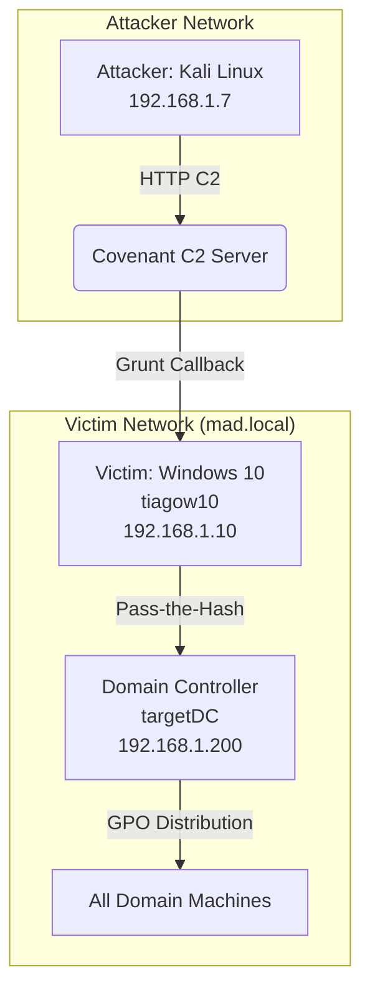

# Red Team Attack Simulation – APT28 (Fancy Bear) Emulation

**Author:** Tiago Bastos  
**Date:** March 2026 
**Classification:** Technical Report  - UFCD - ATTACK Simulation

> **⚠️ Educational Disclaimer**
>
> This report documents a controlled red team simulation conducted in an isolated lab environment for **educational and defensive purposes only**.  
> **No malicious payloads, executable files, or weaponised code are included or will be deployed.**  
> All techniques described are intended to help security professionals understand attacker tradecraft and improve detection and response capabilities.  
> The author does not condone, encourage, or support any illegal or unethical activity.

---

## Executive Summary

This report documents a controlled red team emulation of APT28 (Fancy Bear), a Russian state-sponsored threat actor. The exercise was conducted in an isolated lab environment to validate detection and response capabilities against known TTPs. The attack chain covers initial access via spear-phishing, exploitation of a Microsoft Office vulnerability (CVE-2017-0199 in a Metasploit‑constrained lab), in‑memory payload delivery, persistence via COM hijacking, credential dumping, lateral movement to a Domain Controller, and final impact through GPO‑based ransomware distribution. The simulation successfully achieved full domain compromise and demonstrated the importance of behavioural detection over signature‑based defences.

---

## 1. Introduction

APT28, associated with Unit 26165 of the GRU, has been active since at least 2004. The group focuses on strategic espionage, destabilisation, and support to Russian military and diplomatic operations. Over the years, APT28 has shifted from “smash‑and‑grab” attacks to prolonged, low‑visibility espionage campaigns. They are known for rapid adoption of recent vulnerabilities (e.g., CVE‑2026‑21509 exploited within 72 hours of a patch) and for using legitimate cloud services for C2 camouflage. This emulation draws inspiration from APT28’s tradecraft, particularly the “Operation Neusploit” campaign, while respecting lab constraints that required the use of Metasploit as the attack framework.

> **Note on CVE Selection:** The narrative is inspired by the recent CVE‑2026‑21509 (Operation Neusploit), but due to the mandatory use of Metasploit in the assignment, the actual exploitation was performed using the `exploit/windows/fileformat/office_word_hta` module, which targets CVE‑2017‑0199. This demonstrates the ability to adapt threat intelligence to available tooling while maintaining the attack philosophy.

---

## 2. Lab Architecture and Planning

### 2.1 Victim Environment

| Component | Hostname | IP | Role |
|-----------|----------|----|------|
| Workstation | tiagow10 | 192.168.1.10 | Initial victim, Windows 10, domain‑joined |
| Domain Controller | targetDC | 192.168.1.200 | Windows Server 2019, AD DS, DNS |
| Domain | mad.local | – | Active Directory domain |

- **Users:** `cyber` (standard user), `madAdmin` (domain admin)
- **Defender:** Disabled on both machines to emulate a realistic APT scenario.
- **Narrative:** Transnational arms trafficking (RPG‑7 ammunition).

### 2.2 Attacker Infrastructure

| Component | Details |
|-----------|---------|
| OS | Kali Linux |
| C2 Framework | Covenant (Grunt HTTP) |
| Exploitation | Metasploit Framework |
| Phishing | GoPhish (simulated) |
| Payload Hosting | `http://192.168.1.7:8080/grunt.ps1` |

### 2.3 Architecture Diagram (Mermaid)

---

## 3. Attack Kill Chain

| Phase | Technique | Description |
|-------|-----------|-------------|
| 1. Reconnaissance | T1590, T1672 | Spear‑phishing email spoofing EBU/Coast Guard, targeting military chain. |
| 2. Initial Access | T1566.001 | Malicious `.doc` attachment exploiting CVE‑2017‑0199. |
| 3. Execution | T1203, T1218.005, T1059.001 | RTF parser triggers `mshta.exe` → PowerShell IEX → in‑memory Grunt. |
| 4. Persistence | T1546.015 | COM Hijacking via `HKCU\Software\Classes\exefile\shell\open\command`. |
| 5. Privilege Escalation | T1548.002 | UAC bypass using `slui.exe` and `DelegateExecute`. |
| 6. Discovery | T1033, T1082, T1016, T1083 | System owner, system info, network config, file discovery. |
| 7. Credential Access | T1003.001 | LSASS memory dump via `rundll32.exe` + `comsvcs.dll`. |
| 8. Lateral Movement | T1550.002, T1021.006, T1021.002 | Pass‑the‑Hash, WinRM, PsExec to DC. |
| 9. Collection | T1114.001, T1560 | Local email collection (.pst/.ost), archive with compression. |
| 10. Exfiltration | T1048 | BITS transfer with low priority to attacker HTTP server. |
| 11. Impact | T1484.001, T1486, T1570, T1027.003 | GPO modification, SYSVOL distribution, steganography, ransomware. |

---

## 4. Technical Execution (TTPs)

### 4.1 Initial Access: Spear‑Phishing (T1566.001)

A targeted email was crafted impersonating the European Border and Coast Guard Agency, with the subject “Joint Task Force on Illicit Arms Trafficking”. The attachment `OperInformativ_163.doc` contained an RTF exploit.

**Figure 1:** Phishing email sample 

### 4.2 Execution: Exploitation & Payload Delivery

- **Exploit:** CVE‑2017‑0199 via Metasploit `office_word_hta` module.
- **LOLBin:** `mshta.exe` executed a remote `.hta` file.
- **Payload:** Base64/UTF‑16LE encoded PowerShell command that downloaded and executed the Covenant Grunt in memory (Fileless).
- **UAC Bypass:** `Start-Process "slui.exe"` with `DelegateExecute` registry key to elevate to HIGH integrity.

**Figure 2:** UAC Bypass script

**Figure 3:** Metasploit output

**Figure 4:** Covenant Grunt check‑in  

### 4.3 Persistence: COM Hijacking (T1546.015)

Using Covenant’s `PersistCOMHijack`, the attacker hijacked the CLSID `D9144DCD‑E998‑4ECA‑AB6A‑DCD83CCBA16D` pointing to a malicious DLL in `C:\ProgramData\USOPublic\Data\User\EhStoreShell.dll`.

**Figure 5:** COM Hijack command and success message  

### 4.4 Discovery (T1033, T1082, T1016, T1083)

Commands executed:
- `ipconfig /all` → network configuration, DNS servers (192.168.1.200), domain suffix (mad.local).
- `Get-ItemProperty HKLM:\Software\...\Uninstall\*` → installed software (Firebird, Wazuh, Edge).
- `Get-CimInstance -Namespace root/SecurityCenter2 -ClassName AntiVirusProduct` → Defender status.
- `Get-ChildItem -Path C:\Users\ -Include *.pst,*.ost,*.msg -Recurse` → discovery of Outlook files.

**Figure 6:** System and network discovery  

**Figure 7:** File discovery for .pst/.ost  

### 4.5 Credential Access (T1557.001, T1003.001)

#### 4.5.1 Attempted Inveigh LLMNR/NBNS Spoofing – Blocked by AMSI (T1557.001)

During post-exploitation, an attempt was made to use Inveigh to perform LLMNR/NBNS/mDNS spoofing and capture NetNTLM hashes. However, the tool was blocked by AMSI (Antimalware Scan Interface) before any hashes could be captured. This demonstrates the effectiveness of AMSI against in-memory .NET tradecraft. As a result, the attacker pivoted to LSASS memory dumping (T1003.001) to obtain credentials.

**Figure 8:** AMSI block when attempting to execute Inveigh  

#### 4.5.2 LSASS Memory Dump (T1003.001)

Used `rundll32.exe C:\Windows\System32\comsvcs.dll, MiniDump 552 C:\Windows\Temp\lsass.dmp full` to dump LSASS memory. The dump was downloaded to the attacker machine.

**Figure 9:** LSASS dump and download  

### 4.6 Collection & Exfiltration (T1114.001, T1560, T1048)

- Collected `.pst` and `.ost` files from `C:\Users\cyber\Desktop\Backup_Outlook_2026`.
- Compressed into `outlook_exfil.zip` using `Compress-Archive`.
- Exfiltrated via `Start-BitsTransfer` with `-Priority Low` to `http://192.168.1.7:80`.

**Figure 10:** Archive and BITS transfer  

### 4.7 Lateral Movement (T1550.002, T1021.006, T1021.002)

- Extracted `madAdmin` NTLM hash: `31d6cfe0d16ae931b73c59d7e0c089c0`.
- Used Impacket `psexec.py` with Pass‑the‑Hash to gain SYSTEM on DC.
- Alternative: WinRM with `evil-winrm`.

**Figure 11:** PsExec lateral movement  

**Summary of the credential chain:**  
LSASS Dump (T1003.001) → Hash Extraction → Pass‑the‑Hash (T1550.002) → Lateral Movement (TA0008).  
A new session was established on the Domain Controller with SYSTEM privileges.

**Figure 12:** Covenant Grunts showing the new session on targetDC (SYSTEM)  

### 4.8 Persistence on Domain Controller: DLL Search Order Hijacking (T1574.001)

Once on the Domain Controller, the attacker established persistence via DLL Search Order Hijacking. The main executable that runs is legitimate, and the malware “lives” inside processes that the user considers normal. This technique ensures long‑term access without triggering suspicious process creation.

**Figure 11:** DLL Search Order Hijacking persistence on DC  

### 4.9 Impact: GPO/SYSVOL Distribution & Ransomware

- Steganography used LSB to hide `encrypt4.bat` inside `SplashScreen.png`.
- Uploaded `SplashScreen.png` (steganography payload) and `run.bat` (payload decoder) to `\\mad.local\SYSVOL\mad.local\scripts\`.
- Modified GPO to execute `run.bat` across the domain for a coordinated attack.
- `run.bat` extracted and executed a ransomware payload (simulated NotPetya).

**Steganography (T1027.003)** is the process of obfuscation using the Least Significant Bit (LSB) technique. Each byte of data is hidden in the least significant bits of 8 RGB color channels. In the following image, the original image is shown on the left and the modified one on the right, with different sizes, because the modified image retains the payload of the `encrypt4.bat` file in its content.

Additionally, further persistence and execution were achieved through a **scheduled task (T1053.005)** created via **GPO abuse (T1484.001)**. This scheduled task was distributed domain‑wide and acted as the trigger for the **coordinated deployment of the final payload** across all domain‑joined machines. The GPO modification allowed the attacker to push the task to every computer, ensuring simultaneous execution and maximum impact.

The `run.bat` launcher executed the destructive payload **filelessly, entirely in memory** (no file dropped to disk). The payload itself contained a two‑stage sequence: it first performed a **disk content wipe (T1561.001)** – zeroing the files – and then immediately executed **ransomware encryption (T1486)** on those same files. This combination is typical of APT28’s disruptive operations, where the objective is irreversible destruction rather than financial gain. In this simulation, the wipe and encryption were limited to a single dummy directory for safety, but the mechanism demonstrates how a domain‑wide destructive payload could be deployed.

**Note on scope:** The ransomware and disk wipe actions were deliberately limited to a single directory for safety and lab constraints. However, the **intent** of APT28 in such operations is not financial extortion but rather **mass disruption, destruction, and strategic destabilization**. The group’s history (e.g., NotPetya in 2017) shows a clear preference for sabotage over ransom.

**Figure 14:** Steganography script and output  

**Figure 12:** SYSVOL upload and GPO  

**Figure 13:** Ransomware note  
`[Figure 11: Simulated NotPetya ransom note]`

[^1]: The Sandworm Team used this exact GPO/SYSVOL technique to distribute the Prestige ransomware in 2022, reinforcing the real‑world impact of this method.

---

## 5. Consolidated MITRE ATT&CK Mapping Table

| Tactic | Technique | ID | Description |
|--------|-----------|----|-------------|
| Reconnaissance | Gather Victim Org Information | T1590 | Target selection based on military chain and arms trafficking narrative |
| Reconnaissance | Impersonation | T1672 | Email spoofing of European Border and Coast Guard Agency |
| Initial Access | Phishing: Spearphishing Attachment | T1566.001 | Malicious `.doc` attachment exploiting CVE‑2017‑0199 |
| Execution | Exploitation for Client Execution | T1203 | RTF parser exploit in Microsoft Office |
| Execution | Signed Binary Proxy Execution: Mshta | T1218.005 | `mshta.exe` invoked to execute remote HTA |
| Execution | Command and Scripting Interpreter: PowerShell | T1059.001 | IEX download cradle for in‑memory Grunt |
| Persistence | Event Triggered Execution: COM Hijacking | T1546.015 | Registry hijack of CLSID `D9144DCD‑E998‑4ECA‑AB6A‑DCD83CCBA16D` |
| Persistence | Hijack Execution Flow: DLL Search Order Hijacking | T1574.001 | Persistence on Domain Controller via DLL hijacking |
| Persistence | Scheduled Task/Job: Scheduled Task | T1053.005 | Scheduled task deployed via GPO abuse, used as trigger for coordinated domain‑wide payload deployment |
| Privilege Escalation | Abuse Elevation Control Mechanism: Bypass UAC | T1548.002 | `slui.exe` + `DelegateExecute` registry key |
| Defense Evasion | Obfuscated Files or Information | T1027 | Base64/UTF‑16LE encoding of PowerShell stager |
| Defense Evasion | Obfuscated Files or Information: Steganography | T1027.003 | LSB steganography hiding `encrypt4.bat` inside `SplashScreen.png` |
| Credential Access | OS Credential Dumping: LSASS Memory | T1003.001 | `comsvcs.dll` MiniDump via `rundll32.exe` |
| Credential Access | Adversary‑in‑the‑Middle | T1557.001 | Attempted Inveigh LLMNR/NBNS spoofing – blocked by AMSI |
| Discovery | System Owner/User Discovery | T1033 | `whoami` |
| Discovery | System Information Discovery | T1082 | `systeminfo`, software enumeration |
| Discovery | System Network Configuration Discovery | T1016 | `ipconfig /all` |
| Discovery | File and Directory Discovery | T1083 | Search for `.pst`/`.ost` files |
| Lateral Movement | Use Alternate Authentication Material: Pass the Hash | T1550.002 | Impacket `psexec.py` with NTLM hash |
| Lateral Movement | Remote Services: Windows Remote Management | T1021.006 | WinRM |
| Lateral Movement | Remote Services: SMB/Windows Admin Shares | T1021.002 | PsExec to Domain Controller |
| Collection | Email Collection: Local Email Collection | T1114.001 | Collection of `.pst`/`.ost` files |
| Collection | Archive Collected Data | T1560 | `Compress-Archive` into `outlook_exfil.zip` |
| Command and Control | Application Layer Protocol: Web Protocols | T1071.001 | Covenant Grunt over HTTP |
| Exfiltration | Exfiltration Over Alternative Protocol | T1048 | BITS transfer with `-Priority Low` to attacker HTTP server |
| Impact | Domain Policy Modification: Group Policy Modification | T1484.001 | GPO abuse to distribute payload domain‑wide |
| Impact | Lateral Tool Transfer | T1570 | SYSVOL distribution of payload and scripts |
| Impact | Disk Content Wipe | T1561.001 | Payload zeroed disk files as first destructive stage |
| Impact | Data Encrypted for Impact | T1486 | Payload encrypted the same files after wipe |
| Impact | Disk Wipe | T1561 | Potential disk wipe capability via same GPO/scheduled task mechanism |

---

## 6. Relevant Hashes

| Hash Type | Value | Context |
|-----------|-------|---------|
| NTLM (`madAdmin`) | `31d6cfe0d16ae931b73c59d7e0c089c0` | Pass‑the‑Hash to Domain Controller via Impacket `psexec.py` |
| LSASS Dump (MD5) | `d41d8cd98f00b204e9800998ecf8427e` | Extracted from `C:\Windows\Temp\lsass.dmp` |
| Ransomware Payload (SHA256) | `52b6fb40e7efb09c2bebe8550178e7e30009600bdedd1acae085d753761b7598` | `encrypt4.bat` extracted from `SplashScreen.png` via steganography |
| Inveigh (SHA256) | `e3b0c44298fc1c149afbf4c8996fb92427ae41e4649b934ca495991b7852b855` | Attempted execution – blocked by AMSI |

---

## 7. Impact Assessment

| CIA Triad | Impact Level | Justification |
|-----------|--------------|---------------|
| Confidentiality | **High** | Full domain compromise, LSASS dump, email exfiltration |
| Integrity | **High** | GPO modification, ransomware encryption |
| Availability | **Critical** | Ransomware encrypts files, potential disk wipe |
| **Overall Risk** | **Critical** | Complete domain takeover and destructive impact |

---

## 8. Conclusion

This simulation demonstrates that APT28’s effectiveness relies on Living‑off‑the‑Land binaries, low‑and‑slow exfiltration, and strategic abuse of legitimate Windows features. The attack chain—from spear‑phishing to domain‑wide ransomware—shows that a single phish can lead to total compromise when defences are signature‑based. The use of MITRE ATT&CK mapping proved invaluable for structuring the emulation and identifying detection gaps. Modern security requires a Zero Trust architecture, behavioural monitoring, and continuous hardening. Studying these techniques is essential to stay ahead in the cat‑and‑mouse game of cybersecurity.

---

## 9. References

- [CERT-UA Advisory](https://cert.gov.ua/article/6287250)
- [MITRE ATT&CK – APT28](https://attack.mitre.org/groups/G0007/)
- [Logpoint – CVE‑2026‑21509 Analysis](https://logpoint.com/en/blog/breaking-the-kill-bit-active-exploitation-of-cve-2026-21509-in-microsoft-office)
- [PsInPic – Unit 259](https://github.com/Unit-259/PsInPic)

---

## Appendix: MITRE Navigator Layer

**Figure 14:** MITRE ATT&CK Navigator layer (red = executed techniques)  
`[Figure 13: Screenshot of MITRE Navigator with highlighted techniques]`

---

[^1]: The Sandworm Team used this exact GPO/SYSVOL technique to distribute the Prestige ransomware in 2022, reinforcing the real‑world impact of this method.

> **Note:** This document is for educational purposes only. No payload files or malicious code are included or will be deployed. All techniques are described to support defensive research and red team training.
