

# SIEM Implementation with Wazuh

### Threat detection and automated response in a mixed Windows/Linux environment

**Network and Cybersecurity Administrator**

---

## Project at a Glance

| | |
|---|---|
| **Scenario** | Simulated infrastructure for a fictional company, *Tecnosoft2* |
| **Platform** | Wazuh (Manager + Dashboard) |
| **Environment** | 3 virtual machines on an isolated virtual network |
| **Focus areas** | File Integrity Monitoring, brute-force detection, YARA malware scanning, CDB IP lists, active response |
| **Framework** | MITRE ATT&CK |

**Key results**

- Brute-force attacks over **SSH and RDP** detected and blocked automatically.
- **Malware dropped into monitored folders** detected through FIM + YARA scanning.
- **Custom rules, decoders and CDB lists** built to correlate events and block repeat offenders.
- Attacks simulated against the lab to validate every configuration and map incidents to **MITRE ATT&CK**.

## Contents

1. [Introduction](#1-introduction)
2. [Environment Architecture](#2-environment-architecture)
3. [Brute-Force Attacks](#3-brute-force-attacks)
4. [Malware Detection (Linux Client)](#4-malware-detection-linux-client)
5. [Malware Detection with YARA Rules](#5-malware-detection-with-yara-rules)
6. [File Integrity Monitoring](#6-file-integrity-monitoring)
7. [YARA on the Windows Client](#7-yara-on-the-windows-client)
8. [Remote Desktop Protocol and CDB Lists](#8-remote-desktop-protocol-and-cdb-lists)
9. [Conclusion](#9-conclusion)
10. [Future Improvements](#10-future-improvements)
11. [References](#11-references)

---

## 1. Introduction

This project implements a **Wazuh-based SIEM environment** simulating the infrastructure of a company called *Tecnosoft2*. The ecosystem consists of a Wazuh server (manager and dashboard), a Windows client and a Linux client.

Several security measures were applied to these machines to **monitor, detect and respond to suspicious activity in real time**.

The implementation covered the following areas of cybersecurity:

- **File Integrity Monitoring (FIM)**
- **Detection and mitigation of brute-force attacks** over both SSH and RDP
- **CDB lists** for automatic blocking of malicious IP addresses
- **YARA integration** for malware detection
- **Custom rules** that strengthen analysis and correlation

Real attacks were then simulated to validate the effectiveness of the configurations, and the detected incidents were mapped to the **MITRE ATT&CK** framework, ensuring a structured analysis aligned with recognised industry practice.

---

## 2. Environment Architecture

The environment consists of **three virtual machines**, configured to simulate the essential infrastructure of a small company.

| Machine | OS | Role |
|---|---|---|
| **Wazuh server** | Linux | Runs the Wazuh Manager and Dashboard, centralising event collection, analysis and correlation |
| **Windows client** | Windows | Represents a typical endpoint: RDP access, changes to shared folders and operating-system events |
| **Web server** | Linux | Used to test monitoring of critical directories, SSH attack detection and malware-analysis integration |

The three machines communicate over an **isolated virtual network**, providing a controlled test environment. This simple but functional architecture made it possible to validate Wazuh's ability to monitor different systems, correlate events and apply automatic responses effectively.

---

## 3. Brute-Force Attacks

### Linux client

Brute-force attempts against the Linux client are detected and displayed in the Wazuh dashboard.

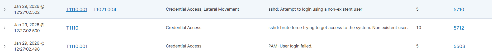
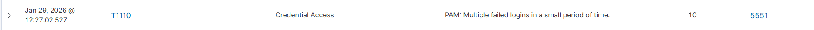
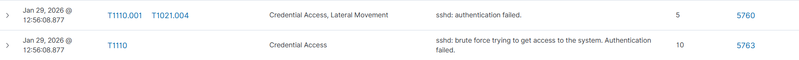

An **active response** blocks the offending address on the client firewall for **60 seconds** whenever rule IDs `5710`, `5551`, `5503`, `5712`, `5760` or `5763` are triggered.

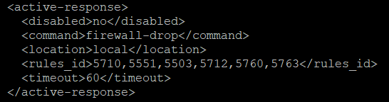

### Windows client

The same type of attack is detected on the Windows client.

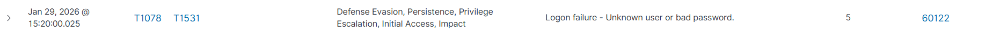

For Windows, the active response blocks the attacking address on the client firewall for **600 seconds** whenever rule ID `60122` is triggered.

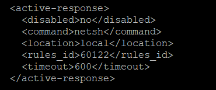

---

## 4. Malware Detection (Linux Client)

Several file additions were detected in the `/var/www/html` directory of the Linux client, all identified by rule **`100301`**. These events show that new files were placed in a short interval, which is typical of suspicious uploads or attempts to introduce malware. FIM recorded the changes immediately, giving visibility over potential compromise of the directory.

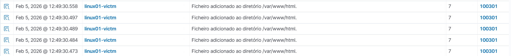

**Rule 100301.** This custom rule raises an alert whenever a file is added to `/var/www/html`. It is built on the original FIM event (SID `554`) and quickly surfaces unexpected uploads, an essential mechanism for catching malicious files or unauthorised changes.

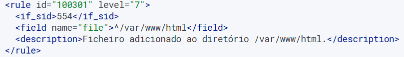

### Threat intelligence with CDB lists

A local rule with ID **`100100`** uses a list of IP addresses and raises an alert whenever an address from that list appears.

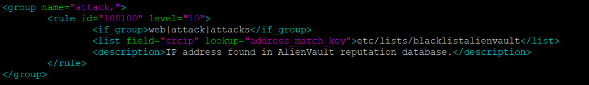

The list was added to the `ruleset` section of `ossec.conf` so that Wazuh loads it.

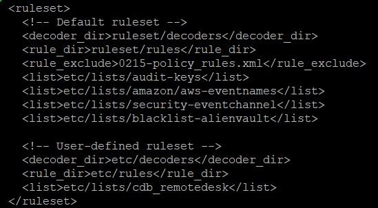

An **active response** blocks access from the address for 60 seconds each time rule `100100` fires.

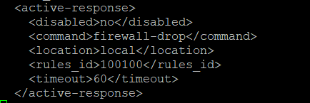

Apache access-log collection was also enabled on the agent.

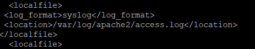

---

## 5. Malware Detection with YARA Rules

**Local rules for file events.** Rules `100300` and `100301` (Linux clients) and `100303` and `100304` (Windows clients) detect files added and modified in `/var/www/html` (Linux) and `E:\Partilha` (Windows).

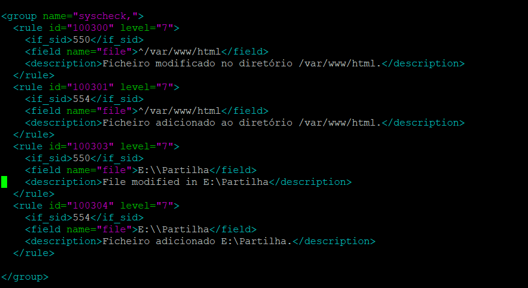

**Scan and detection rules.** Rules `108000` and `108001` trigger scanning and malware detection on files created or modified in the directories above.

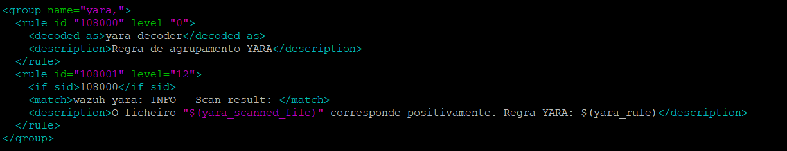

**Decoder.** A custom decoder normalises the logs collected by the agent.

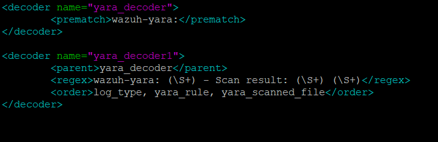

**Command and active response.** A command and its matching active response run the `yara.sh` script on the client to scan the file whenever rules `100300` or `100301` fire.

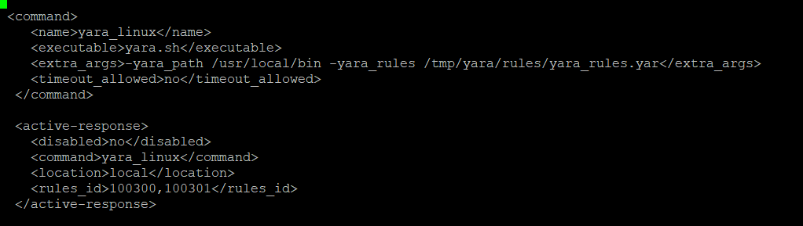

### Active response script

This script lets Wazuh automatically run a YARA scan whenever FIM detects a change to a file. It receives the parameters sent by Wazuh, identifies the path of the modified file and the YARA rules to apply, waits until the file is fully written, and then runs the scan. If malicious patterns are found, the result is written to the active-responses log, making suspicious files quick to identify.

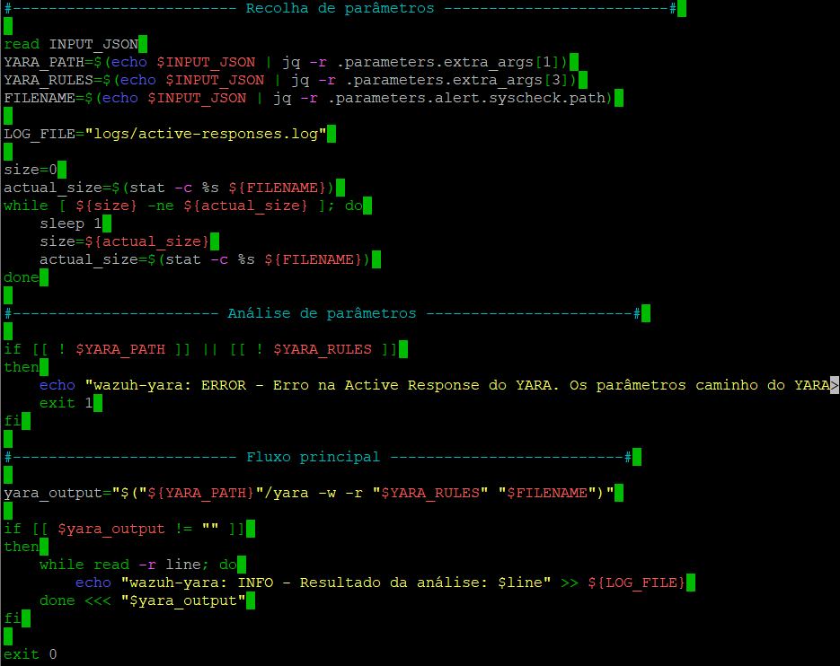

### Malware test script

A script was used to download real malware samples in order to test the effectiveness of the YARA rules and Wazuh monitoring. Before downloading, it shows a warning and asks for confirmation, ensuring the operation is intentional. Once confirmed, the **Mirai, Xbash, VPNFilter and WebShell** samples are downloaded directly into `/var/www/html`, simulating real infection scenarios and validating automatic detection through FIM and YARA analysis.

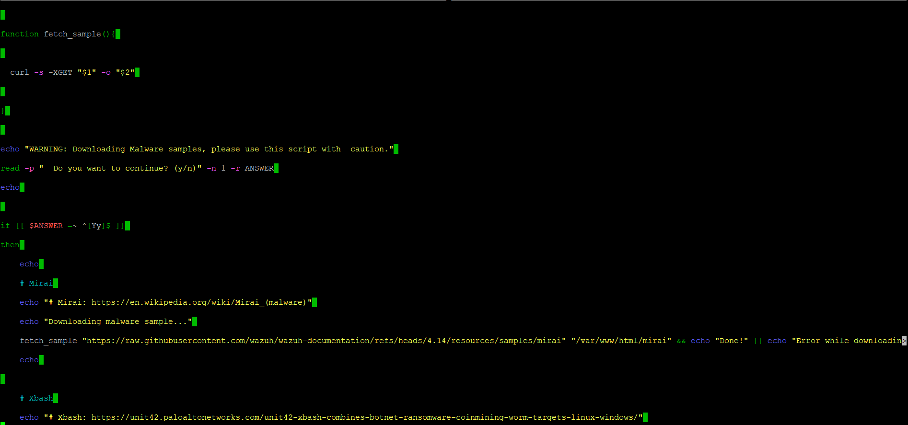
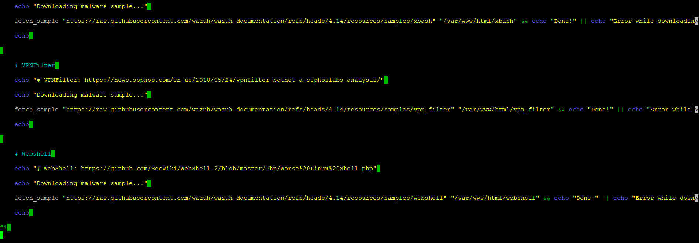

> **Note:** Samples like these should only ever be handled inside an isolated lab.

---

## 6. File Integrity Monitoring

File Integrity Monitoring (FIM) safeguards the integrity of files by detecting changes to critical files and directories, such as network shared folders and user folders. Depending on the configuration, changes can be analysed in real time or periodically. Whenever a change is detected, a log event is sent to the Manager, which raises an alert based on the configured rules.

For the demonstration, a shared folder was created on the network at `\\DESKTOP-UOA5FB8\Partilha`. This folder is considered high risk because it can be abused to move tools or malware between systems on the same network, a TTP identified as **T1570, Lateral Tool Transfer**.

### Agent configuration

Monitoring a folder requires matching rules and configuration on both the Wazuh manager and the agent. On the agent, the folders are declared in `ossec.conf`; the process is the same on Windows and Linux.

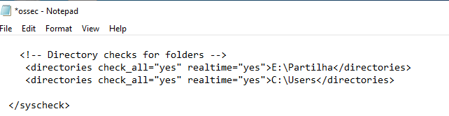
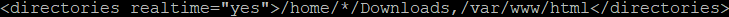

### Manager configuration

On the manager, rules are defined in `local_rules.xml` so events are easy to identify. A custom rule was created for the specific shared folder. The same approach works for Windows and Linux: just add more rules in the same format with a different rule ID and path.

All events can be reviewed under **Agents > Threat Hunting > Events**, or directly in the File Integrity Monitoring module.

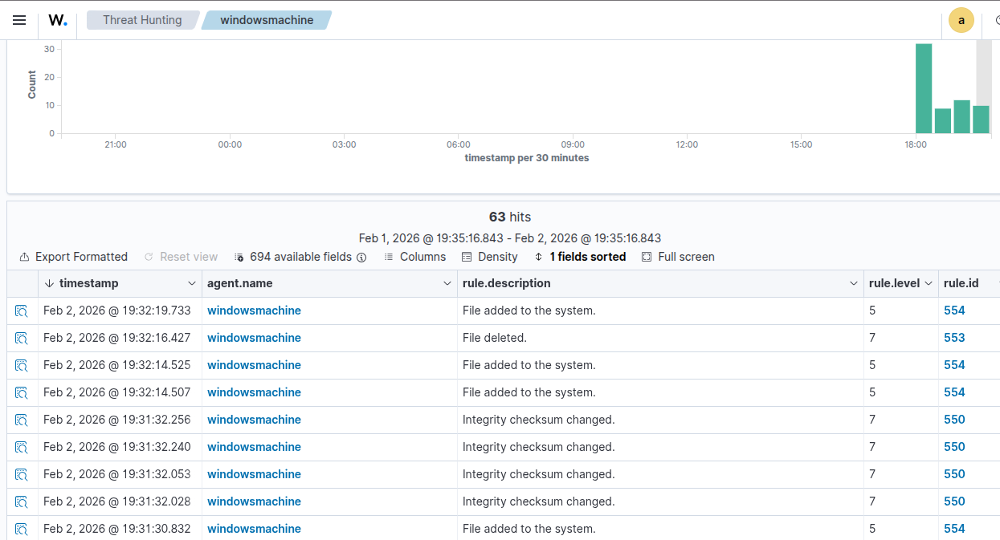

---

## 7. YARA on the Windows Client

YARA is a natural complement to FIM, significantly improving detection of malware and suspicious files at the host level. With YARA integrated, Wazuh can actively analyse files against known malware signatures and their variants.

When Wazuh detects a change to a file, it automatically starts a YARA scan. This classifies suspicious files quickly and **reduces false positives**; if a file matches a malicious rule, a high-severity alert is raised immediately.

This makes it possible to detect characteristic TTPs such as:

| Technique | Name |
|---|---|
| T1105 | Ingress Tool Transfer |
| T1059 | Command Execution |
| T1027 | Obfuscated/Compressed Files |
| T1486 | Ransomware (Data Encrypted for Impact) |

An active response for files flagged by YARA was added to `ossec.conf`, similar to the earlier Linux configuration.

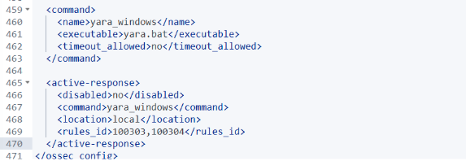

The YARA detections can be seen in the events view.

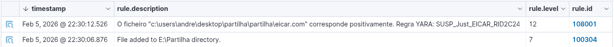

---

## 8. Remote Desktop Protocol and CDB Lists

To monitor RDP access, monitoring rules and active responses were added for Windows and Linux. Rules like these help identify and mitigate characteristic TTPs:

| Technique | Name |
|---|---|
| T1110 | Brute Force |
| T1021 | Remote Services |
| T1133 | External Remote Services |

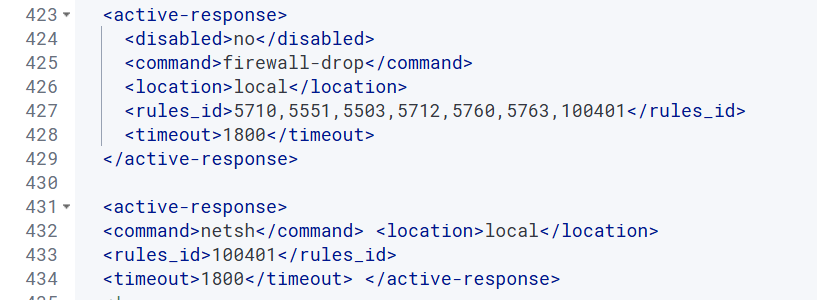

Active responses using `firewall-drop` (Linux) and `netsh` (Windows) block offenders immediately through firewall rules.

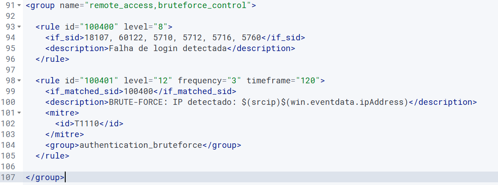

After **3 failed logins over RDP or SSH within 120 seconds**, an alert is raised and the source is blocked through `netsh` or `firewall-drop` respectively. The source is prevented from trying again for **30 minutes**, and the IP of the machine attempting remote access is reported in the alert.

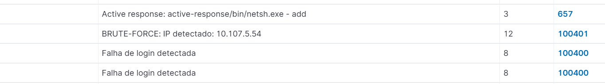

The IP reported in this alert can be used to build **CDB lists**. Once added to the `cdb_remotedesk` blocklist, the attacker is blocked automatically.

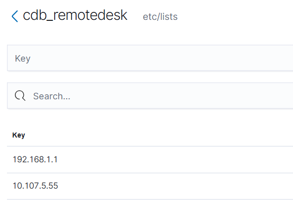

A further rule alerts when a **repeat offender** appears in `cdb_remotedesk`. That address is blocked immediately, while the record is kept so patterns that identify suspicious origins, or false positives, can be reviewed.

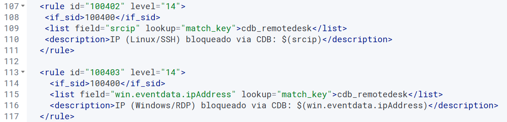

---

## 9. Conclusion

Implementing a Wazuh-based SIEM environment validated, in practice, the importance of **continuous monitoring and early incident detection** in mixed Windows and Linux infrastructures. The configured capabilities (FIM, brute-force detection, CDB lists, custom rules and YARA integration) demonstrated the ability to identify suspicious changes, analyse potentially malicious files and trigger effective automatic responses.

The simulations confirmed that Wazuh is a robust solution for centralising events, correlating anomalous behaviour and strengthening the security of critical systems. Overall, the project showed the value of a well-configured SIEM as an essential element in protecting enterprise environments.

---

## 10. Future Improvements

- **Suricata as a network IDS.** Wazuh monitors endpoint events; Suricata would add visibility into network-based attacks such as scans, exploitation attempts and suspicious traffic, strengthening detection and correlation.
- **VirusTotal integration with the YARA rules.** Suspicious files would be validated automatically against multiple malware databases, increasing accuracy and reducing false positives.
- **Quarantine mechanism.** Suspicious files flagged by Wazuh or YARA would be isolated automatically, reducing the risk of execution. A dedicated alert should also fire on any attempt to remove or tamper with quarantined files.
- **Custom YARA rules for "Living off the Land" (LotL) techniques**, such as:
  - T1059, Command and Scripting Interpreter
  - T1218, Signed Binary Proxy Execution
  - T1105, Ingress Tool Transfer
  - T1053, Scheduled Task/Job

---

## 11. References

- [Yara-Rules community rules](https://github.com/Yara-Rules/rules)
- [Wazuh Proof of Concept Guide](https://documentation.wazuh.com/current/proof-of-concept-guide/index.html)
- [MITRE ATT&CK](https://attack.mitre.org/)
